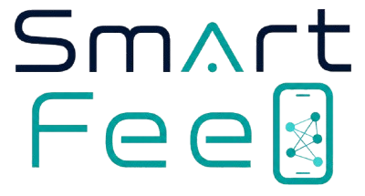

# Smart Feed : Hybrid AI Recommendation System



Smart Feed is a personalized content recommendation system built with AI. It analyzes user reading behavior (likes, views, watch time, comments) and generates a real-time feed adapted to each user's interests, using a three-phase hybrid architecture.

---

## Table of Contents

- [Architecture Overview](#architecture-overview)
- [Getting Started](#getting-started)
- [Setup & Sync Git LFS](#setup--sync--git-lfs)
- [Phase 1 : Toxicity Module](#phase-1--toxicity-module)
- [Phase 2 : Collaborative Filtering](#phase-2--collaborative-filtering)
- [API : Firebase & FastAPI](#api--firebase--fastapi)
- [Scoring Formula](#scoring-formula)
- [API : Endpoints Quick Reference](#api-endpoints--quick-reference)

---

## Architecture Overview

The system is built as three progressive phases:

**Phase 1 : Content-Based (v1):** Semantic similarity search using FAISS and SBERT embeddings (all-MiniLM-L6-v2, 384 dimensions).

**Phase 2 : Hybrid (v2):** Combines content-based filtering with collaborative filtering (Implicit ALS) and weighted re-ranking. Category diversification limits results to a maximum of 3 articles per theme.

**Phase 3 : Multimodal (v3):** Extends to visual content (COCO images via CLIP, UCF-101 videos via VideoMAE) in a shared 512-dimensional embedding space.

All phases are served through a FastAPI RESTful API backed by Firebase Firestore for user profile and interaction persistence, with a Detoxify toxicity filter applied as a hard gate before any recommendation is returned.

---

## Getting Started

**Prerequisites:** Python 3.12, Git LFS installed, Firebase credentials configured in `.env`.

```bash
# Clone and install dependencies
git clone <repo-url>
cd backend
pip install -r requirements.txt

# Start the API
uvicorn app.main:app --reload --port 8000
```

---

## Setup & Sync Git LFS

After the LFS history rewrite, all team members must re-sync before working on the repo.

**Install Git LFS once:**
```bash
git lfs install
```

**Safest option re-clone the repo:**
```bash
git clone <repo-url>
cd <repo>
git lfs pull
```

**Alternative : reset without re-cloning (only if you have no local changes):**
```bash
git fetch --all
git checkout main
git reset --hard origin/main
git lfs pull
```

---

## Phase 1 : Toxicity Module

The toxicity module uses Detoxify calibrated against the Jigsaw Toxicity dataset. The optimal threshold (F1 = 0.81) is 0.20, any article exceeding this threshold is excluded from the feed entirely.

**Setup and calibration:**
```bash
cd backend

# Load Jigsaw data (uses local CSV if already present)
python data/load_jigsaw.py

# Calibrate threshold — uses a 2k sample and prints the best F1
python scripts/calibrate_threshold.py

# Update .env with the recommended threshold
# Current best: TOXICITY_THRESHOLD=0.20
```

**Verification:**
```bash
# Quick smoke test
python -m app.models.toxicity

# Unit tests
pytest tests/test_toxicity.py -v
```

**Calibration results:**

| Threshold | Precision | Recall | F1-Score |
|-----------|-----------|--------|----------|
| 0.10      | 0.61      | 0.92   | 0.73     |
| 0.15      | 0.71      | 0.88   | 0.79     |
| **0.20 (retained)** | **0.78** | **0.84** | **0.81** |
| 0.25      | 0.83      | 0.78   | 0.80     |
| 0.30      | 0.87      | 0.71   | 0.78     |

---

## Phase 2 : Collaborative Filtering

Collaborative filtering is handled by Implicit ALS trained on user interaction matrices. The CF score adjusts the final ranking: a strong CF signal (+0.08 boost above 0.75) pulls relevant content up; a weak signal (-0.05 penalty below 0.40) pushes it down.

```bash
cd backend

# Run full validation suite with diagnostics
python -m tests.collaborative_validation

# Unit tests
pytest tests/test_collaborative.py -v
```

**ALS model parameters:** 64 factors, regularization 0.1, 50 iterations.

---

## API : Firebase & FastAPI

Smart Feed's backend is a FastAPI application served by Uvicorn (ASGI), with Firebase Firestore as the persistence layer for user profiles, embeddings, and interaction history. Heavy models (SBERT, FAISS, ALS, Detoxify) are loaded once at startup via `@lru_cache(maxsize=1)` to avoid per-request reloads.

**Start the server:**
```bash
uvicorn app.main:app --reload --port 8000
```

**Interactive documentation:**
```
http://localhost:8000/docs     (Swagger UI)
http://localhost:8000/redoc    (ReDoc)
```

**Nightly retraining:** An APScheduler cron job re-trains models automatically at 02:00 every night.

---

## Scoring Formula

**Re-ranking formula applied by `rank_candidates()` in `ranker.py`:**

```
score_final = 0.45 × similarity(user_emb, post_emb)
            + 0.25 × (1 − toxicity_score)
            + 0.15 × popularity(likes, views)
            + 0.15 × freshness(created_at)
```

With collaborative filtering adjustment:
- CF score > 0.75 → +0.08
- CF score in [0.60, 0.75] → +0.04
- CF score < 0.40 → −0.05

**Freshness:** Exponential decay with a 7-day half-life `exp(−ln(2) / 7 × age_days)`.

**Popularity:** Log-normalized `min(1.0, log1p(likes + views × 0.1) / log1p(10 000))`.

**Mode-dependent weights for `compute_score()` in `scoring.py`:**

| Mode     | w_similarity | w_quality | w_preference | w_recency |
|----------|-------------|-----------|--------------|-----------|
| default  | 0.40        | 0.30      | 0.20         | 0.10      |
| focus    | 0.60        | 0.25      | 0.10         | 0.05      |
| fun      | 0.20        | 0.20      | 0.50         | 0.10      |
| learning | 0.50        | 0.30      | 0.15         | 0.05      |
| fresh    | 0.20        | 0.15      | 0.15         | 0.50      |

---

## API Endpoints : Quick Reference

| Method | Endpoint | Description |
|--------|----------|-------------|
| GET    | `/api/feed/{user_id}` | Personalized feed (`limit`, `version`: v1/v2/v3) |
| POST   | `/api/interact` | Record a user interaction |
| GET    | `/api/preferences/{user_id}` | Read user preferences |
| PUT    | `/api/preferences/{user_id}` | Update preferences (mode, interests, toxicity threshold) |
| POST   | `/api/preferences/{user_id}/mode/{mode}` | Switch mode |
| POST   | `/api/admin/retrain` | Trigger model retraining (background task) |
| POST   | `/api/admin/rebuild-index` | Rebuild FAISS index (background task) |
| GET    | `/health` | Health check |

**Test with curl:**

```bash
# 1. Get feed for a new user
curl "http://localhost:8000/api/feed/bob?limit=5"

# 2. Record an interaction
curl -X POST "http://localhost:8000/api/interact" \
  -H "Content-Type: application/json" \
  -d '{
    "user_id": "bob",
    "post_id": "post_99",
    "post_text": "Les bienfaits du sport sur la sante",
    "action": "like",
    "watch_time": 0.0
  }'

# 3. Check preferences
curl "http://localhost:8000/api/preferences/bob"

# 4. Switch to learning mode
curl -X POST "http://localhost:8000/api/preferences/bob/mode/learning"

# 5. Re-check feed after interactions
curl "http://localhost:8000/api/feed/bob?limit=10"
```

**Example feed response (`GET /api/feed/sim_user_17?version=v2&limit=1`):**

```json
{
  "user_id": "sim_user_17",
  "version": "v2",
  "ranking_method": "hybrid_xgboost",
  "mode": "default",
  "count": 1,
  "feed": [
    {
      "id": "42857",
      "headline": "How AI is transforming healthcare",
      "category": "TECH",
      "score": 0.8134,
      "rank_score": 0.8892,
      "score_detail": {
        "content_based": 0.81,
        "collaborative": 0.87,
        "cosine_sim": 0.76
      },
      "explanation": {
        "summary": "Recommande car : tres similaire a tes interets (76%), tres populaire chez des lecteurs similaires"
      }
    }
  ]
}
```

---
		
## Team

| Member | Role | Responsibilities |
|--------|------|-----------------|
| Sohaib BOUKTIBA | ML Engineer / Embeddings & MLOps | SBERT embeddings, Implicit ALS training, DevOps |
| Yassine BIBRINE | ML Engineer / Classification & Multimodal | DistilBERT fine-tuning, CLIP, VideoMAE, Phase 3 pipeline |
| Ismail HIRICH | ML Engineer / Indexation & Security | FAISS indexes v1/v2/v3, Detoxify integration, threshold calibration |
| Ali ACHENAN | Backend Engineer & Scoring | FastAPI endpoints, Firebase, scoring.py, ranker.py, explainability.py, user_profile.py |
| Zakaria NASR-ALLAH | Technical Writer & Frontend | Report, Swagger/README documentation, pytest suite, frontend |

**Supervisor:** M. Said AMMARI. Master d'Excellence M1 IAOC, Ibn Tofail University, 2025/2026
